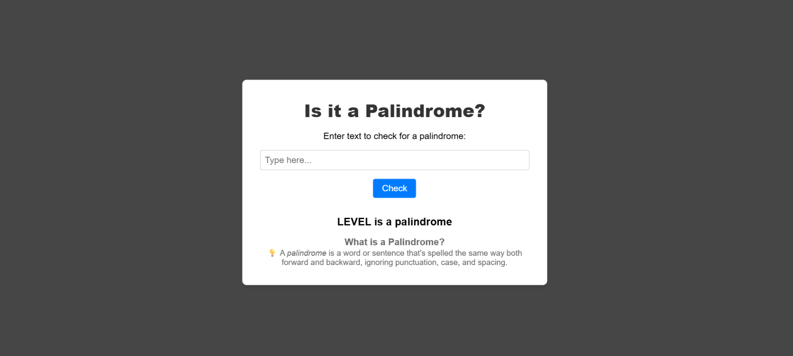

Palindrome Checker 🔁

A minimal, fast, and interactive web app that checks whether a given word or sentence is a palindrome — with instant results and a clean UI.

🚀 Live Demo

🔗 Try it here: https://samir-bk.github.io/Palindrome-Checker/

✨ Features

🔍 Real-time palindrome detection

🧹 Auto-cleans input (removes spaces, punctuation, symbols)

⚡ Lightweight JavaScript

📱 Responsive design

🎨 Simple, clean UI

🧠 What’s a Palindrome?

A palindrome reads the same forwards and backwards.
Examples:

racecar ✔️

madam ✔️

hello ❌

Your app checks all of these instantly.

🛠️ Tech Stack

HTML5

CSS3

JavaScript (Vanilla)

GitHub Pages for hosting

📦 Local Setup
git clone https://github.com/samir-bk/Palindrome-Checker
cd Palindrome-Checker

# open index.html in your browser

📌 How It Works

Takes user input

Converts to lowercase

Removes spaces + special characters

Reverses the cleaned string

Compares original vs reversed

Shows ✔️ or ❌ result

Simple. Fast. Accurate.

🖼️ Screenshot

🤝 Contributing

Pull requests are welcome!

Fork

Create a branch

Commit your changes

Open a PR

📄 License

Released under the MIT License — free to use and modify.
